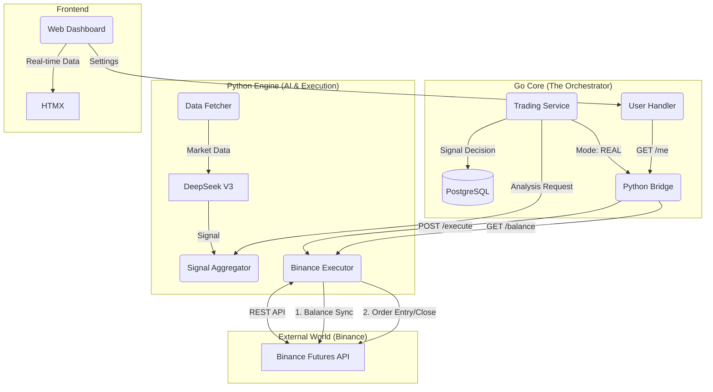

# 🧠 NeuroTrade AI - System Architecture "The Bible"
**Last Updated:** 2026-01-08 (Session: AI Cost Optimization & Debug)
**Version:** 5.4 (Cost Optimization + API Validation)

---

## 📌 CURRENT SESSION CONTEXT

### 🔴 Active Issue (2026-01-08):
**ISSUE:** Tidak ada signal selama 2 hari meskipun BTC drop ~4% (dari $93,825 ke $89,972)

**ROOT CAUSE ANALYSIS:**
1. `BTC_VOLATILITY_THRESHOLD` = 0.2% → Terlalu tinggi, slow gradual moves tidak terdeteksi
2. `VISION_THRESHOLD` = 65% → Logic confidence harus tinggi sebelum Vision dipanggil
3. Quality veto penalty >= 40 → Terlalu aggressive membunuh signals
4. RSI extreme tidak di-consider untuk override

**FIXES APPLIED:**
1. ✅ BTC threshold: 0.2% → 0.1% + RSI extreme bypass (< 35 or > 65 = action time)
2. ✅ Vision threshold: 65% → 55%
3. ✅ Quality veto: 40 → 50 penalty required
4. ✅ Agreement logic: 75% → 70% logic override + RSI extreme override (> 60% conf + extreme RSI)

**Status:** Deployed. Monitor over next 24h for signal generation.

### ✅ Completed Today:
1. API Key validation before save (Settings)
2. Block REAL mode without valid keys
3. **Signal Sensitivity Fix:** Tuned thresholds to catch bigger market moves
4. **RSI Extreme Override:** Allow signals when RSI is < 30 or > 70

### 💬 Communication Rules:
- Balas **singkat & jelas**
- Update file ini jika ada **info penting**
- Jangan repeat info yang sudah diketahui

---

## 🚀 QUICK DEPLOYMENT (Admin Only)

```bash
# 1. Configure .env
# Ensure BINANCE_API_KEY and BINANCE_API_SECRET are set for Real Trading
# Ensure BINANCE_DRY_RUN=false if you want to use real money

# 2. Deploy
docker-compose down
docker-compose up --build -d

# 3. Check Real Trading Connection
docker-compose logs -f python-engine | grep "BinanceExecutor"
```

---

## 📋 Table of Contents
1. [High-Level Architecture](#-1-high-level-architecture)
2. [Real Trading Engine](#-2-real-trading-engine-new)
3. [The AI Engine (Python)](#-3-the-ai-engine-python)
4. [The Core Logic (Go)](#-4-the-core-logic-go)
5. [User Settings & Safety](#-5-user-settings--safety)
6. [Database Schema](#-6-database-schema)
7. [Operational Cheatsheet](#-7-operational-cheatsheet)
8. [Configuration Reference](#-8-configuration-reference-env)
9. [Future Roadmap (Refactor)](#-9-future-roadmap-refactor)
10. [Changelog](#-10-changelog)

---

## 🏗️ 1. High-Level Architecture

NeuroTrade is a **Hybrid Trading System** combining a high-performance Go backend for execution/safety with a Python microservice for AI inference and charting.

### 🔄 End-to-End Data Flow (v5.0)



---

## 💸 2. Real Trading Engine (NEW)

Located in `python-engine/services/execution.py`. This module handles the "dirty work" of talking to Binance with real money.

### Features:
1.  **Dual Mode:** Supports `DRY_RUN` (simulate execution) and `LIVE` (real orders).
2.  **Safety First:**
    *   **Min Notional Check:** Rejects orders < $5 (Binance Limit) to prevent API errors.
    *   **Reduce Only:** Closing orders use `reduceOnly=True` to prevent accidental flipping of positions.
    *   **Rounding:** Automatically rounds quantity to `lotSize` precision (e.g., 0.001 BTC).

### Order Sizing Logic:
*   **User Input:** `FixedOrderSize` (Initial Margin, e.g., $10).
*   **User Setting:** `Leverage` (e.g., 20x).
*   **Calculation:** `Total Notional = Margin * Leverage` (e.g., $200).
*   **Binance Order:** Sends `amount_usdt = 200`.

---

## 🤖 3. The AI Engine (Python)

Located in `python-engine/`. Acts as a stateless inference server and now, an execution gateway.

### Component Overview
| Component | Responsibility | Tech Details |
|-----------|----------------|--------------|
| **Screener** | Market Scanning | Parallel filtering (12 threads). |
| **Whale Detector** | Pump/Dump Prediction | WebSocket stream (!forceOrder). |
| **AI Logic** | Strategy Reasoning | DeepSeek V3 (Reasoning Model). |
| **I/O Executor** | Real Trading | CCXT Library. Global API Key (Single Tenant). |

### 🔥 PRO Screener Logic (v3.1)
*   **Parallel Execution**: 12 Threads.
*   **Multi-Timeframe**: 15m + 4H analysis.
*   **Filters**: Volume Anomaly (>1.2x), Trend Alignment (EMA200), RSI Action Zone.
*   **Throughput**: 60 coins Scanned in < 3 seconds.

---

## 🛡️ 4. The Core Logic (Go)

Located in `internal/`. Handles state, money management, and safety.

### 🔒 3-Layer Signal Defense
1.  **Mutex Lock**: Prevents race conditions from overlapping cron jobs.
2.  **Batch Deduplication**: Prevents duplicate signals in same batch.
3.  **Active Position Check**: Prevents opening multiple orders for same coin.

### 🔄 Real-Time Balance Sync
*   **Trigger**: When user visits Dashboard (GET /api/user/me).
*   **Condition**: Only if `User.Mode == "REAL"`.
*   **Process**: Go calls Python -> Python calls Binance -> Go updates `RealBalanceCache` in DB (Async).
*   **UI**: Shows "Syncing..." or real balance instantly.

---

## ⚙️ 5. User Settings & Safety

### Configuration Options (Dashboard)
1.  **Trading Mode**: `PAPER` (Default) vs `REAL`.
2.  **Fixed Margin**: The amount of **Cash** to risk per trade (e.g., $5).
3.  **Leverage**: Multiplier (e.g., 20x).
4.  **Auto-Trading**: Enable/Disable automated execution.

### Safety Mechanisms
*   **Default Mode:** New users start in `PAPER` mode.
*   **Fail-Fast:** If Real Execution fails (e.g., API Error), the position is **NOT** recorded in DB to maintain consistency.
*   **Visual Indicators:** Red "REAL" badge in Dashboard when money is at risk.

---

## 🗄️ 6. Database Schema

### `users` table
| Column | Type | Purpose |
|--------|------|---------|
| `fixed_order_size` | Decimal | **Margin** amount per trade (e.g., $5.0). |
| `leverage` | Decimal | **Leverage** multiplier (e.g., 20.0). |
| `mode` | String | 'PAPER' or 'REAL'. |
| `real_balance_cache` | Decimal | Cached wallet balance to reduce API calls. |

### `positions` table (Unified)
| Column | Type | Purpose |
|--------|------|---------|
| `size` | Decimal | Quantity of coins. |
| `pnl` | Decimal | Realized Dollar P&L. |
| `pnl_percent` | Decimal | **Calculated on fly** (PnL / Margin * 100). |
| `status` | String | OPEN / CLOSED_WIN / CLOSED_LOSS. |

---

## 🚀 7. Operational Cheatsheet

### 🟢 Start Real Trading
1.  Set `.env`: `BINANCE_API_KEY`, `BINANCE_API_SECRET`.
2.  Dashboard -> Settings -> Switch to **REAL**.
3.  Set Margin (e.g., $5) and Leverage (20x).
4.  Enable **Auto-Trading**.

### ⚠️ Emergency Stop
1.  Click **"Stop Auto-Trading"** in Settings.
2.  Or use **Panic Button** (Closes all positions).

### 🧪 Test Mode
*   Use `python-engine/test_real_trade.py` to test connection with $1 margin.

---

## 📝 9. Future Roadmap (Refactor)

**Current Status:** "PaperPosition" tables handle both Real and Paper trades using the `User.Mode` flag.

**Future Refactor Plan:**
1.  **Multi-Tenant Keys:** Move API Key from `.env` to encrypted DB column (`users.api_key`) to allow multiple users to trade with their own accounts. (Planned v6.0)

**Completed Refactors (v5.1):**
*   [x] Rename Tables: `paper_positions` -> `positions`.
*   [x] Rename Repository: `PaperPositionRepository` -> `PositionRepository`.
*   [x] Rename Structs: `PaperPosition` -> `Position`.

---

## 📅 10. Changelog

### Session: 2026-01-07 (v5.0 - Real Trading Suite)
**Major Feature:** Full integration of Binance Futures execution with User Settings.

#### ✅ Features:
1.  **Real Trading Execution Module (Python):**
    *   New `BinanceExecutor` with smart rounding and safety checks.
    *   Endpoints: `/execute/entry`, `/execute/close`, `/execute/balance`.
2.  **User Settings Interface:**
    *   New Modal for Mode, Margin, Leverage, Auto-Trade.
    *   Backend persistence in `users` table.
3.  **End-to-End Integration:**
    *   Go `TradingService` route signals to Python if Mode=REAL.
    *   Correct Order Sizing (Margin vs Notional).
4.  **UI Enhancements:**
    *   **User Settings Tab:** Dedicated tab for Trading Preferences (replacing Modal) for better UX.
    *   **AI Signals UI:** Fixed PnL currency formatting (e.g., `-$1.13` instead of `$-1.13`) and percentage display.
    *   Real-time Balance Sync (conditionally displayed).
    *   Settings Menu relocated to Sidebar.
    *   PnL Percentage fix for Signals list (Hybrid Logic).

#### 🛡️ Security Audit:
*   **Fund Safety:** Verified Notional Calculation and Min Limit checks.
*   **Access Control:** Settings protected by JWT. Fail-safe defaults.

**System Status:** READY FOR LIVE TRADING 🚀

### Session: 2026-01-07 (v5.1 - Codebase Refactor)
**Cleanup:** Refactored entire codebase to standardize naming for Hybrid Trading.

#### ✅ Refactoring & Migration:
1.  **Naming Refactor:**
    *   Renamed `PaperPosition` -> `Position` across Domain, Repository, and Services.
    *   Renamed `internal/domain/paper_position.go` to `position.go`.
    *   Established `PositionRepository` as the single source for all trading records.
2.  **Database Migration:**
    *   Table `paper_positions` renamed to `positions`.
    *   **Auto-Migration:** Added `009_rename_paper_positions.sql` to automatically rename the table on startup.
    *   Updated all Backend SQL queries to use `positions` table.

**Status:** Codebase is Clean & Consistent. Database is Auto-Migrated.

### Session: 2026-01-07 (v5.2 - UX & Stability)
**Focus:** User Experience Polish, Auth Fixes, and API Stability (Anti-Ban).

#### ✅ UI/UX Improvements:
1.  **Auth & Settings:**
    *   **Custom Validation:** Removed native browser popups on Login/Register for cleaner UX.
    *   **API Key Masking:** Added "Eye" toggle to hide/show API keys in Settings.
    *   **Edit Capability:** Users can now seamlessy update API keys.
2.  **Dialogs:**
    *   Replaced native `window.confirm()` and `alert()` with custom **React Portal Modals** (`ConfirmDialog`).

#### 🔧 Critical Fixes:
1.  **Auth System Repair:**
    *   Fixed `Invalid credentials` error caused by database trying to scan `NULL` API keys into Go strings. Implemented `COALESCE` fix in Repository layer.
    *   Solved issue where API Keys were not saving to DB (same root cause).
2.  **Anti-Ban Logic (Binance):**
    *   **Relaxed Scheduler:** Adjusted Cronscan frequency from 10s -> 30s (Aggressive), 1m (Normal), 5m (Slow) to respect API limits.
    *   Optimized Scheduler trigger to `*/30` seconds.
3.  **Logging:**
    *   Silenced duplicate/spammy `httpx` logs in Python Engine for cleaner debugging.

**System Status:** Stable Auth, Safer Scanning, Polished UI.

### Session: 2026-01-07 (v5.3 - Signal Quality Enhancement)
**Focus:** Reduce premature SL hits and improve signal durability.

#### 🎯 Problem Solved:
*   Signals with 80% confidence were hitting SL within 20 minutes
*   Root causes: tight SL, no 1H confirmation, entry near S/R levels, choppy structure

#### ✅ Screener Improvements (`screener.py`):
1.  **1H Confirmation Layer:**
    *   New `check_1h_confirmation()` method validates direction against 1H EMA 9/21 trend
    *   Signals conflicting with 1H trend get penalized (-25 score) or downgraded to NEUTRAL
    *   Strong whale signals (≥80% conf) can override 1H rejection

2.  **Market Structure Validation:**
    *   New `check_market_structure()` analyzes Higher Highs/Lows pattern
    *   CHOPPY structure = -20 score penalty
    *   Clean UPTREND/DOWNTREND = +15 score bonus

3.  **Support/Resistance Proximity Check:**
    *   New `check_sr_proximity()` detects entries within 0.3% of key levels
    *   Entries near S/R (resistance/support/BB bands) = -15 score penalty

4.  **Volume Sustainability Filter:**
    *   New `check_volume_sustainability()` requires 2 of last 3 candles with >1.2x avg volume
    *   No sustained volume = -10 score penalty

#### ✅ AI Handler Improvements (`ai_handler.py`):
1.  **Dynamic SL Rules (Updated Prompt):**
    *   MINIMUM SL: 0.5% (was 0.1% - too tight!)
    *   MAXIMUM SL: 2.0% (was 5.0% - tighter capital protection)
    *   RECOMMENDED: 1x ATR from entry (adapts to volatility)

2.  **Validation Layer Updates:**
    *   MIN_SL_PCT: 0.1% → 0.5%
    *   MAX_SL_PCT: 5.0% → 2.5%
    *   MIN_RR: 1.1 → 1.3 (better risk:reward)

3.  **Quality Filter Veto in `combine_analysis()`:**
    *   New veto layer checks screener quality metrics
    *   If total quality_penalty ≥ 40 → Signal vetoed
    *   Quality penalty also reduces combined_confidence

#### 🚀 NEW: Directional Momentum System (PUMP/DUMP Prediction):
*   New `calculate_directional_momentum()` method with 5 confluence factors:
    1.  **ROC (Rate of Change)** - 3 & 5 candle price momentum
    2.  **EMA 9/21 Crossover** - Quick trend detection
    3.  **RSI Slope** - Momentum acceleration
    4.  **Volume-Price Confirmation** - High-volume directional candles
    5.  **HH/HL Pattern** - Short-term structure in last 5 candles
*   Priority order updated: Whale > **Momentum** > RSI+Trend
*   Momentum boost: +25 score max for high confidence direction

#### ⚙️ Filter Relaxation (Keep Signal Quantity):
*   **Volume Sustainability:** Removed penalty (only bonus now) - scalpers catch first spike
*   **Choppy Structure:** Penalty reduced from -20 to -15
*   **S/R Proximity:** Penalty reduced from -15 to -10

#### 🛡️ Anti-Fake Detection (New):
*   Single Candle Dominance check (>60% move in 1 candle = manipulation)
*   Wick Rejection detection (long wicks = price rejection)
*   Volume Divergence (price up but volume down = weak)
*   Reversal Candle detection (immediate reversal after move)
*   Fake penalty >= 40 → Signal killed

#### 🧠 Enhanced ML Learning (New):
*   Training now uses `ai_analysis_cache` (15+ features vs 8)
*   New features: logic_confidence, vision_confidence, ai_agreement, whale signals
*   New insights: AI Agreement WR, High Confidence WR, Whale Signal effectiveness
*   Better win probability prediction with more data

#### 🗑️ Removed (Signal Quality Cleanup):
*   `scan_pump_candidates()` disabled (5m TF noise, low-cap false positives)
*   Old pump priority sorting removed
*   Pump-based threshold reduction reduced (was -20%, now -15% max)

#### 📊 Expected Results:
*   Signals should last 45-90 minutes instead of 20 minutes
*   Fewer premature SL hits (better SL placement)
*   **Better PUMP/DUMP accuracy** (anti-fake detection)
*   **Smarter ML predictions** (enhanced learning)

**System Status:** Enhanced Screener + Anti-Fake + Enhanced ML 🎯🚀🧠
