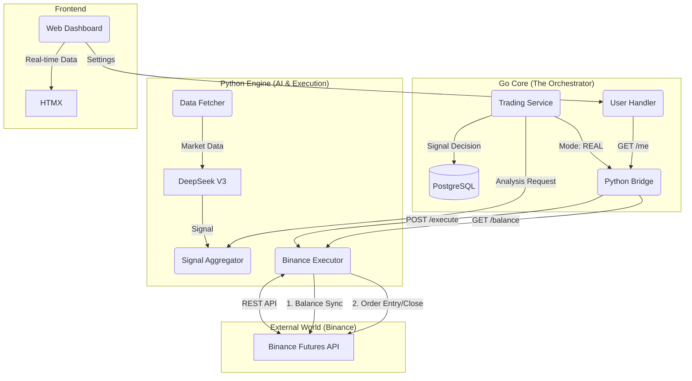

# 🧠 NeuroTrade AI - System Architecture "The Bible"
**Last Updated:** 2026-01-07 (Session Real Trading)
**Version:** 5.0 (Real Trading Integration + User Control)

---

## 🚀 QUICK DEPLOYMENT (Admin Only)

```bash
# 1. Configure .env
# Ensure BINANCE_API_KEY and BINANCE_API_SECRET are set for Real Trading
# Ensure BINANCE_DRY_RUN=false if you want to use real money

# 2. Deploy
docker-compose down
docker-compose up --build -d

# 3. Check Real Trading Connection
docker-compose logs -f python-engine | grep "BinanceExecutor"
```

---

## 📋 Table of Contents
1. [High-Level Architecture](#-1-high-level-architecture)
2. [Real Trading Engine](#-2-real-trading-engine-new)
3. [The AI Engine (Python)](#-3-the-ai-engine-python)
4. [The Core Logic (Go)](#-4-the-core-logic-go)
5. [User Settings & Safety](#-5-user-settings--safety)
6. [Database Schema](#-6-database-schema)
7. [Operational Cheatsheet](#-7-operational-cheatsheet)
8. [Configuration Reference](#-8-configuration-reference-env)
9. [Future Roadmap (Refactor)](#-9-future-roadmap-refactor)
10. [Changelog](#-10-changelog)

---

## 🏗️ 1. High-Level Architecture

NeuroTrade is a **Hybrid Trading System** combining a high-performance Go backend for execution/safety with a Python microservice for AI inference and charting.

### 🔄 End-to-End Data Flow (v5.0)



---

## 💸 2. Real Trading Engine (NEW)

Located in `python-engine/services/execution.py`. This module handles the "dirty work" of talking to Binance with real money.

### Features:
1.  **Dual Mode:** Supports `DRY_RUN` (simulate execution) and `LIVE` (real orders).
2.  **Safety First:**
    *   **Min Notional Check:** Rejects orders < $5 (Binance Limit) to prevent API errors.
    *   **Reduce Only:** Closing orders use `reduceOnly=True` to prevent accidental flipping of positions.
    *   **Rounding:** Automatically rounds quantity to `lotSize` precision (e.g., 0.001 BTC).

### Order Sizing Logic:
*   **User Input:** `FixedOrderSize` (Initial Margin, e.g., $10).
*   **User Setting:** `Leverage` (e.g., 20x).
*   **Calculation:** `Total Notional = Margin * Leverage` (e.g., $200).
*   **Binance Order:** Sends `amount_usdt = 200`.

---

## 🤖 3. The AI Engine (Python)

Located in `python-engine/`. Acts as a stateless inference server and now, an execution gateway.

### Component Overview
| Component | Responsibility | Tech Details |
|-----------|----------------|--------------|
| **Screener** | Market Scanning | Parallel filtering (12 threads). |
| **Whale Detector** | Pump/Dump Prediction | WebSocket stream (!forceOrder). |
| **AI Logic** | Strategy Reasoning | DeepSeek V3 (Reasoning Model). |
| **I/O Executor** | Real Trading | CCXT Library. Global API Key (Single Tenant). |

### 🔥 PRO Screener Logic (v3.1)
*   **Parallel Execution**: 12 Threads.
*   **Multi-Timeframe**: 15m + 4H analysis.
*   **Filters**: Volume Anomaly (>1.2x), Trend Alignment (EMA200), RSI Action Zone.
*   **Throughput**: 60 coins Scanned in < 3 seconds.

---

## 🛡️ 4. The Core Logic (Go)

Located in `internal/`. Handles state, money management, and safety.

### 🔒 3-Layer Signal Defense
1.  **Mutex Lock**: Prevents race conditions from overlapping cron jobs.
2.  **Batch Deduplication**: Prevents duplicate signals in same batch.
3.  **Active Position Check**: Prevents opening multiple orders for same coin.

### 🔄 Real-Time Balance Sync
*   **Trigger**: When user visits Dashboard (GET /api/user/me).
*   **Condition**: Only if `User.Mode == "REAL"`.
*   **Process**: Go calls Python -> Python calls Binance -> Go updates `RealBalanceCache` in DB (Async).
*   **UI**: Shows "Syncing..." or real balance instantly.

---

## ⚙️ 5. User Settings & Safety

### Configuration Options (Dashboard)
1.  **Trading Mode**: `PAPER` (Default) vs `REAL`.
2.  **Fixed Margin**: The amount of **Cash** to risk per trade (e.g., $5).
3.  **Leverage**: Multiplier (e.g., 20x).
4.  **Auto-Trading**: Enable/Disable automated execution.

### Safety Mechanisms
*   **Default Mode:** New users start in `PAPER` mode.
*   **Fail-Fast:** If Real Execution fails (e.g., API Error), the position is **NOT** recorded in DB to maintain consistency.
*   **Visual Indicators:** Red "REAL" badge in Dashboard when money is at risk.

---

## 🗄️ 6. Database Schema

### `users` table
| Column | Type | Purpose |
|--------|------|---------|
| `fixed_order_size` | Decimal | **Margin** amount per trade (e.g., $5.0). |
| `leverage` | Decimal | **Leverage** multiplier (e.g., 20.0). |
| `mode` | String | 'PAPER' or 'REAL'. |
| `real_balance_cache` | Decimal | Cached wallet balance to reduce API calls. |

### `paper_positions` table (Naming to be Refactored)
| Column | Type | Purpose |
|--------|------|---------|
| `size` | Decimal | Quantity of coins. |
| `pnl` | Decimal | Realized Dollar P&L. |
| `pnl_percent` | Decimal | **Calculated on fly** (PnL / Margin * 100). |
| `status` | String | OPEN / CLOSED_WIN / CLOSED_LOSS. |

---

## 🚀 7. Operational Cheatsheet

### 🟢 Start Real Trading
1.  Set `.env`: `BINANCE_API_KEY`, `BINANCE_API_SECRET`.
2.  Dashboard -> Settings -> Switch to **REAL**.
3.  Set Margin (e.g., $5) and Leverage (20x).
4.  Enable **Auto-Trading**.

### ⚠️ Emergency Stop
1.  Click **"Stop Auto-Trading"** in Settings.
2.  Or use **Panic Button** (Closes all positions).

### 🧪 Test Mode
*   Use `python-engine/test_real_trade.py` to test connection with $1 margin.

---

## 📝 9. Future Roadmap (Refactor)

**Current Status:** "PaperPosition" tables handle both Real and Paper trades using the `User.Mode` flag.

**Future Refactor Plan:**
1.  **Rename Tables:** `paper_positions` -> `positions`.
2.  **Rename Repository:** `PaperPositionRepository` -> `PositionRepository`.
3.  **Rename Structs:** `PaperPosition` -> `Position`.
4.  **Multi-Tenant Keys:** Move API Key from `.env` to encrypted DB column (`users.api_key`) to allow multiple users to trade with their own accounts.

---

## 📅 10. Changelog

### Session: 2026-01-07 (v5.0 - Real Trading Suite)
**Major Feature:** Full integration of Binance Futures execution with User Settings.

#### ✅ Features:
1.  **Real Trading Execution Module (Python):**
    *   New `BinanceExecutor` with smart rounding and safety checks.
    *   Endpoints: `/execute/entry`, `/execute/close`, `/execute/balance`.
2.  **User Settings Interface:**
    *   New Modal for Mode, Margin, Leverage, Auto-Trade.
    *   Backend persistence in `users` table.
3.  **End-to-End Integration:**
    *   Go `TradingService` route signals to Python if Mode=REAL.
    *   Correct Order Sizing (Margin vs Notional).
4.  **UI Enhancements:**
    *   **User Settings Tab:** Dedicated tab for Trading Preferences (replacing Modal) for better UX.
    *   **AI Signals UI:** Fixed PnL currency formatting (e.g., `-$1.13` instead of `$-1.13`) and percentage display.
    *   Real-time Balance Sync (conditionally displayed).
    *   Settings Menu relocated to Sidebar.
    *   PnL Percentage fix for Signals list (Hybrid Logic).

#### 🛡️ Security Audit:
*   **Fund Safety:** Verified Notional Calculation and Min Limit checks.
*   **Access Control:** Settings protected by JWT. Fail-safe defaults.

**System Status:** READY FOR LIVE TRADING 🚀
