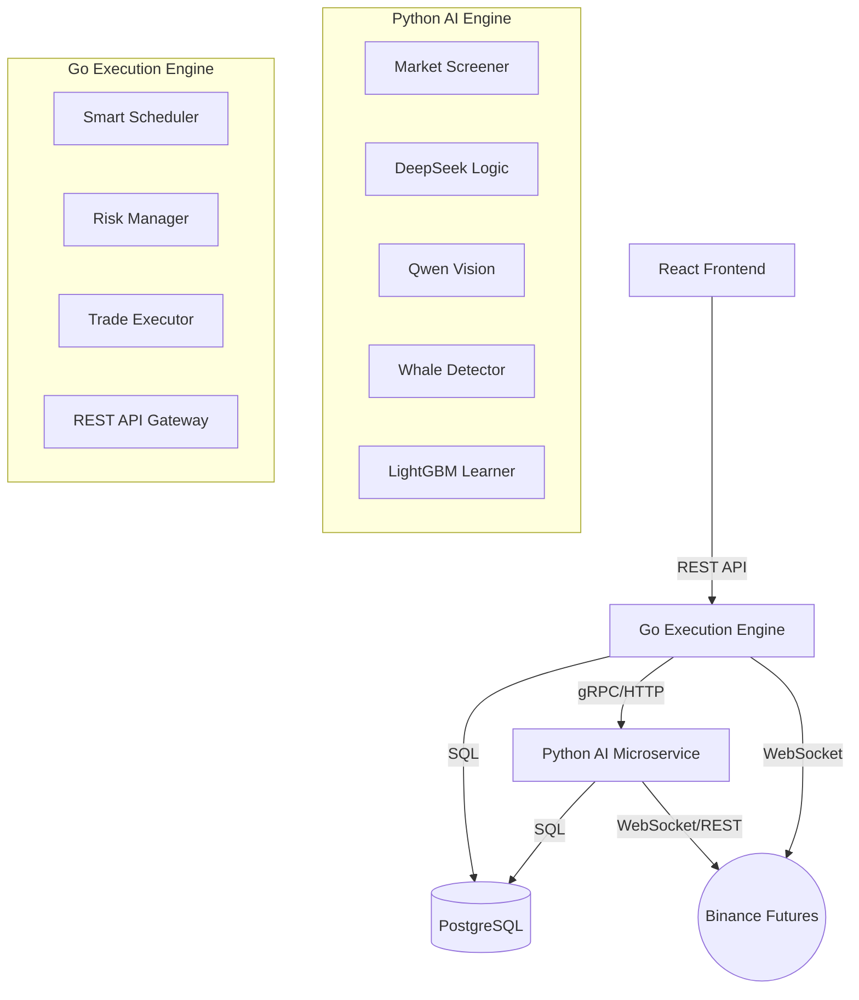

# 🧠 NeuroTrade AI

> **Next-Gen Hybrid AI Trading System**
> *Where Logic Meets Vision, and Experience Drives Execution.*

NeuroTrade is a production-grade autonomous trading system designed for Binance Futures. It bridges the gap between quantitative analysis and AI cognition by combining a high-performance **Go** execution engine with a multi-modal **Python** AI microservice.

Unlike traditional bots, NeuroTrade doesn't just trade—it **learns**. With its self-improving Machine Learning core and extensive "AI Brain Center" analytics, it adapts to market conditions in real-time.

---

## ✨ Key Capabilities

### 🧠 Hybrid AI Intelligence
*   **Logic Core (DeepSeek V3):** Analyzes market structure, price action, and risk ratios with human-like reasoning.
*   **Vision Core (Qwen3 VL 235B):** "Sees" the chart like a pro trader, identifying patterns (Head & Shoulders, Flags) and validating support/resistance levels.
*   **Consensus Engine:** Trades are only executed when both Logic and Vision AI agree (High Agreement Rate).

### 🛡️ Anti-Fake & Whale Detection
*   **Directional Momentum:** Uses advanced ROC, RSI slope, and EMA crossovers to detect genuine momentum vs. fake pumps.
*   **Fake Pump Penalty:** Penalizes movements with wick rejections or price-volume divergence, filtering out "bull traps."
*   **Whale Radar:** Tracks 6 key signals including Liquidation Cascades, Order Book Imbalances, and Institutional Flow to follow the Smart Money.

### 📚 Self-Learning ML System
*   **Continuous Backfill:** Automatically simulates trade outcomes for missed or passed signals to enrich the training dataset.
*   **Adaptive Learning:** Uses LightGBM to learn from historical wins and losses, adjusting confidence thresholds dynamically.
*   **Predictive Analytics:** Calculates "Win Probability" for every new signal based on thousands of past scenarios.

### ⚡ Professional Execution
*   **Go Backend:** Ultra-low latency execution and risk management.
*   **Dynamic Trailing Stop:** Auto-locks profits at configurable percentages.
*   **Risk Guard:** Multi-layer protection (Position Limits, Max Risk per Trade, Daily Drawdown Limits).
*   **Golden Hours:** Smart scheduling to trade only during high-probability market sessions (London/NY Overlaps).

---

## 🏗️ System Architecture

The system follows a clean, microservices-based architecture:



---

## 📊 AI Brain Center (Analytics)

NeuroTrade includes a dedicated **AI Analytics Dashboard** providing deep insights into the bot's cognition:

*   **Brain Health:** Monitor total analyzed signals, execution rates, and AI agreement levels.
*   **Confidence Distribution:** See how confident the AI is across different market conditions.
*   **Whale Tracking:** Real-time visibility into institutional market movements.
*   **Learning Database:** Track the growth of the ML dataset with automated outcome simulation.

---

## 🚀 Quick Start

### Prerequisites
*   Docker & Docker Compose
*   Binance Futures Account (Testnet or Real)
*   API Keys: DeepSeek, OpenRouter (for Qwen Vision)

### Installation

1.  **Clone the repository:**
    ```bash
    git clone https://github.com/yourusername/neurotrade.git
    cd neurotrade
    ```

2.  **Configure Environment:**
    ```bash
    cp .env.example .env
    # Edit .env and add your API keys (BINANCE, DEEPSEEK, OPENROUTER, etc.)
    ```

3.  **Start the System:**
    ```bash
    docker-compose up --build -d
    ```

4.  **Access the Dashboard:**
    Open `http://localhost:8080/dashboard` in your browser.

---

## 🔧 Configuration Guide

### Critical Environment Variables

| Variable | Description |
|----------|-------------|
| `PYTHON_ENGINE_URL` | URL of the Python service (e.g., `http://python-engine:8001`) |
| `MIN_CONFIDENCE` | Minimum AI confidence score (0-100) to execute a trade. |
| `TOP_COINS_LIMIT` | Number of top volatile coins to scan simultaneously. |
| `MAX_RISK_PERCENT` | Maximum % of portfolio at risk per trade. |
| `TELEGRAM_BOT_TOKEN` | (Optional) Token for real-time alerting. |

---

## 🛡️ Safety Mechanisms

1.  **Double Veto System:** Even if Logic loves a trade, Vision can veto it if the chart looks ugly. Even if both agree, ML can veto it if historical data suggests low probability.
2.  **Anti-Drain:** "Panic Button" feature to immediately close all positions if the market crashes.
3.  **Balance Guard:** Automatic trading halt if daily loss exceeds a defined threshold.

---

## 📄 License

Private / Proprietary Software.
All rights reserved.

---

*"Success in trading is not about predicting the future. It's about recognizing the probabilities of the present."*
